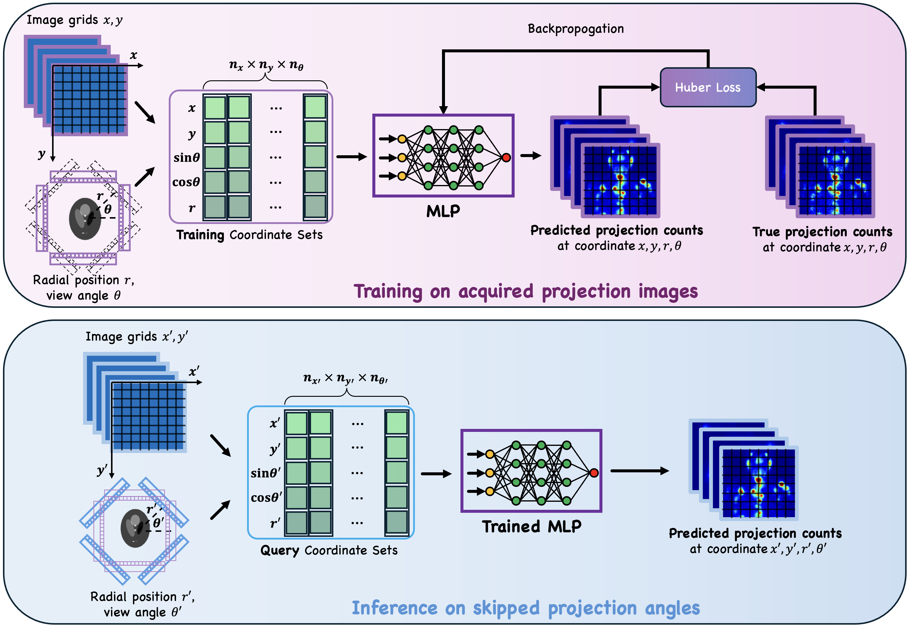

# SpeRF: Shorter SPECT scans using self-supervised coordinate learning to synthesize skipped projection views

This repository contains the official implementation of
[Shorter SPECT scans using self-supervised coordinate learning to synthesize skipped projection views](https://doi.org/10.1186/s40658-025-00762-3).


## Pipeline Overview

This study addresses the challenge of extended SPECT imaging duration under low-count conditions, as encountered in Lu-177 SPECT imaging, by developing a self-supervised learning approach to synthesize skipped SPECT projection views, thus shortening scan times in clinical settings.



## Code and Datasets

The majority of the source code is written in [Python](https://www.python.org). Neural networks are built and trained using the [PyTorch](https://pytorch.org/) automatic differentiation framework. Reconstruction and analysis code are written in [MATLAB](https://www.mathworks.com/products/matlab.html). The datasets generated and/or analyzed during the current study are available from the corresponding author on reasonable request.

## Environment Setup

To set up the environment for SpeRF, we provide an `environment.yml` file that contains all the necessary dependencies. You can create and activate the conda environment using the commands below. 

```
conda env create --file environment.yml --prefix /path/to/your/conda/env
conda activate sperf
```

## Getting Started

To reproduce the pipeline for generating/synthesizing SPECT projections from new angle, run:
```
./run.sh
```

## Working Directory Structure
To run SpeRF, you need to organize your working directory in a specific folder structure. Each scan should be placed in its own subfolder inside the working directory. Within each scan subfolder, there must be exactly three subdirectories:

1. `config/`: contains configuration files for this scan.
2. `patient_data/`: stores the patient-specific data. This folder must contain two subfolders:
   - `proj/`: contains projection data files (`proj_main.jld2`, `proj_scatter.jld2`).
   - `radial_position/`: contains the file `radial_position.txt`.
3. `src/`: holds the scripts and executables needed to run the model and processing pipeline for the scan.

You can copy the provided `config/` and `src/` templates into each scan folder as needed.

The final directory tree should look like this:

```
working_directory/
├── Scan1/
│   ├── config/
│   │   └── ...
│   ├── patient_data/
│   │   ├── proj/
│   │   │   ├── proj_main.jld2
│   │   │   └── proj_scatter.jld2
│   │   └── radial_position/
│   │       └── radial_position.txt
│   └── src/
│       └── ...
├── Scan2/
│   ├── config/
│   ├── patient_data/
│   └── src/
├── Scan3/
│   ├── config/
│   ├── patient_data/
│   └── src/
...
```

## SPECT Reconstruction

After novel views projection synthesis, you can reconstruct the SPECT images using the [Michigan Image Reconstruction Toolbox](https://web.eecs.umich.edu/~fessler/code/). We provide scripts for DOTATATE and PSMA reconstruction (Full, Partial, LinInt, SpeRF, BerThin) in the `recon/` folder. 

## Analysis

For simplicity, we provide source code for analysis only for DOTATATE scans. The analysis for PSMA scans follows the same procedure, with the exception of some differences in data file names. Please locate `cal_NRMSE_linear_sperf_projs.m`, `cal_RA_dotatate.m` and `cal_RCNR_dotatate.m` in the `analysis/` folder to reproduce the results in our paper. 

## Citation

If you find this work useful, please cite it as follows:

```bib
@article{li2025shorter,
  title={Shorter SPECT scans using self-supervised coordinate learning to synthesize skipped projection views},
  author={Li, Zongyu and Jia, Yixuan and Xu, Xiaojian and Hu, Jason and Fessler, Jeffrey A and Dewaraja, Yuni K},
  journal={EJNMMI physics},
  volume={12},
  number={1},
  pages={1--16},
  year={2025},
  url={https://doi.org/10.1186/s40658-025-00762-3},
  publisher={Springer}
}
```
